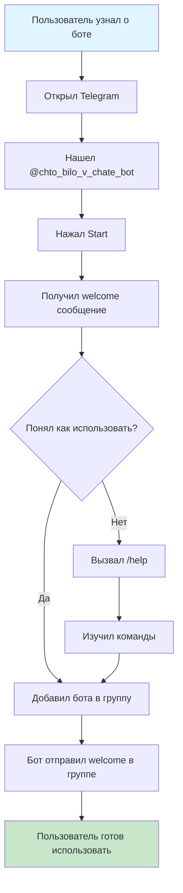
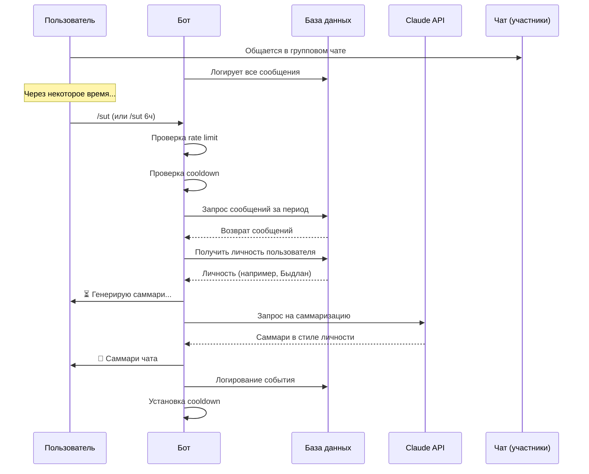
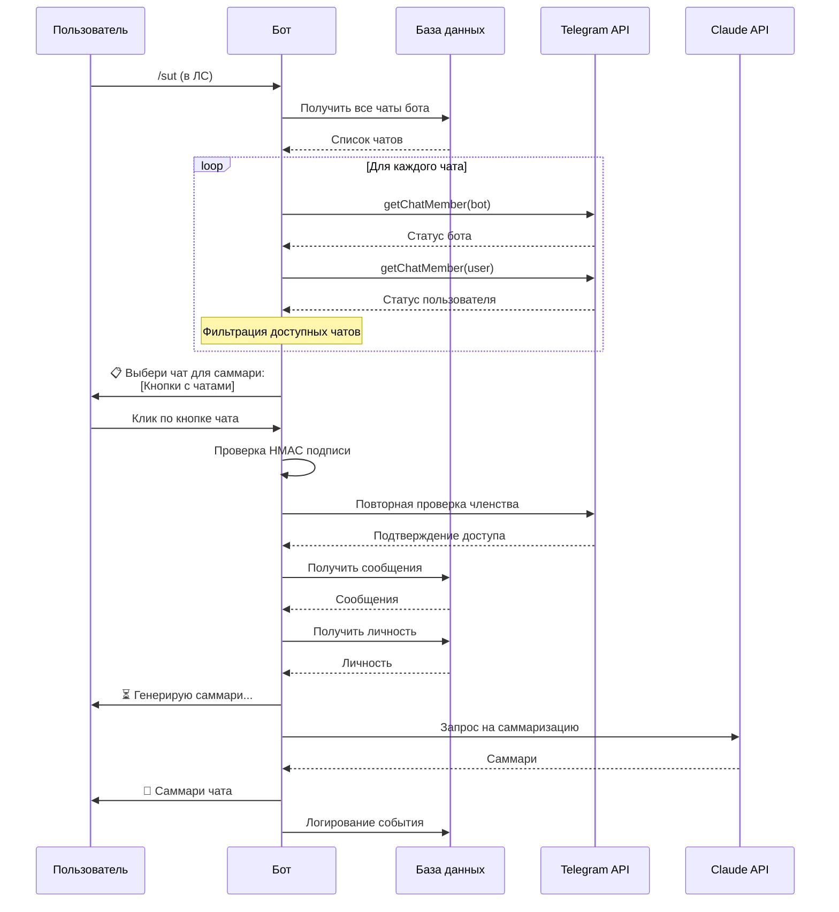
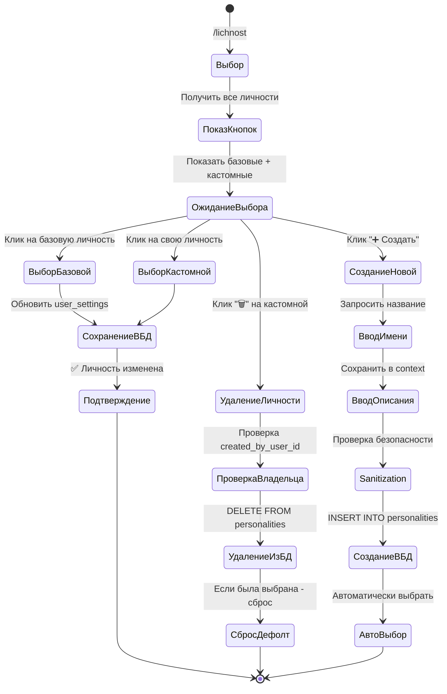
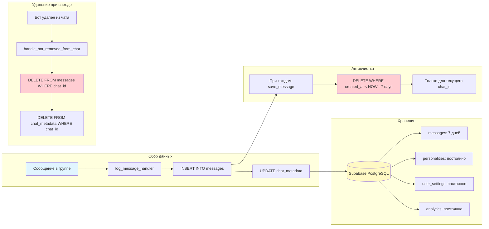
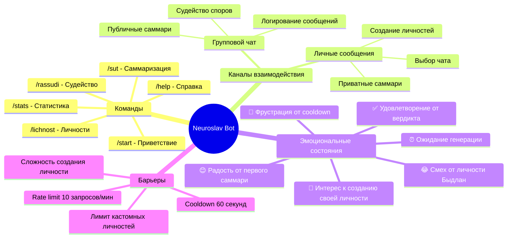
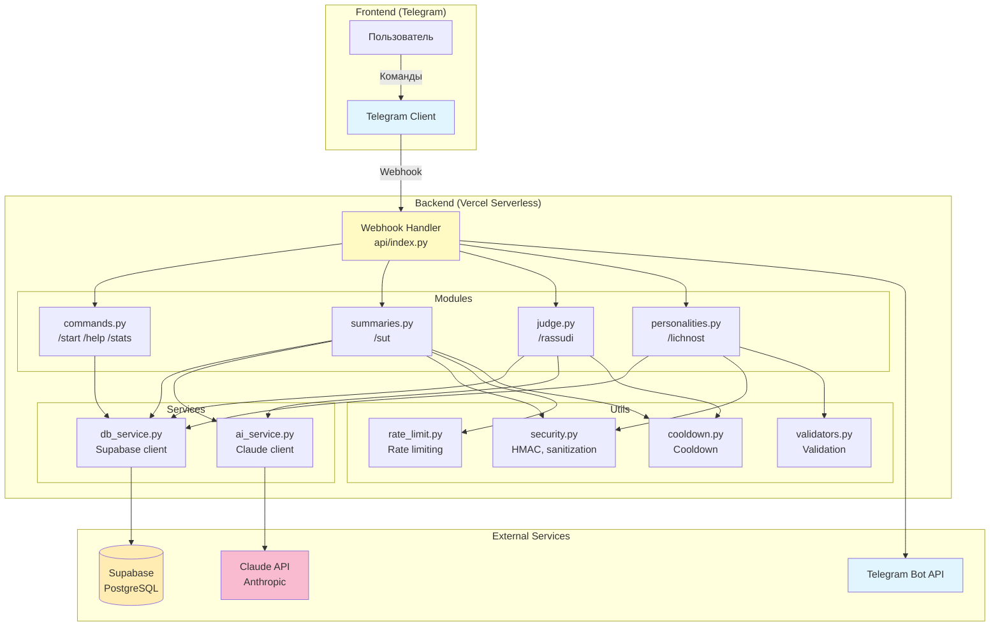

# Customer Journey Map - Neuroslav Bot

## Полная карта пути пользователя

```mermaid
journey
    title Customer Journey Map - Neuroslav Bot (Полный путь пользователя)
    section Знакомство с ботом
      Узнал о боте от друзей: 3: Пользователь
      Нашел бота в Telegram: 4: Пользователь
      Запустил /start: 5: Пользователь, Бот
      Прочитал приветствие: 4: Пользователь
      Изучил команды через /help: 4: Пользователь, Бот

    section Первое использование
      Добавил бота в групповой чат: 5: Пользователь
      Увидел welcome сообщение: 5: Пользователь, Бот
      Написал несколько сообщений в чате: 4: Пользователь, Участники
      Вызвал /sut в группе: 5: Пользователь
      Ждет генерацию (⏳ Генерирую саммари...): 3: Пользователь, Бот
      Получил первое саммари: 5: Пользователь, Бот
      Поделился с друзьями: 5: Пользователь, Участники

    section Знакомство с личностями
      Узнал про личности AI: 4: Пользователь
      Вызвал /lichnost: 5: Пользователь
      Увидел выбор из 7 базовых личностей: 5: Пользователь, Бот
      Выбрал "Быдлан 🏭": 5: Пользователь
      Попробовал /sut с новой личностью: 5: Пользователь, Бот
      Посмеялся над результатом: 5: Пользователь, Участники

    section Использование в ЛС
      Открыл ЛС с ботом: 4: Пользователь
      Вызвал /sut в ЛС: 5: Пользователь
      Увидел кнопки с чатами: 5: Пользователь, Бот
      Выбрал нужный чат: 5: Пользователь
      Получил саммари в ЛС: 5: Пользователь, Бот

    section Создание своей личности
      Решил создать свою личность: 5: Пользователь
      Вызвал /lichnost → Создать свою: 5: Пользователь
      Ввел название (Пират): 4: Пользователь
      Ввел описание стиля: 4: Пользователь
      Получил подтверждение создания: 5: Пользователь, Бот
      Попробовал новую личность: 5: Пользователь, Бот
      Показал друзьям: 5: Пользователь, Участники

    section Рассуждение споров
      Увидел спор в чате: 3: Пользователь, Участники
      Вызвал /rassudi с описанием спора: 5: Пользователь
      Ждет вердикт (⚖️ Размышляю...): 4: Пользователь, Бот
      Получил вердикт от AI судьи: 5: Пользователь, Бот, Участники
      Обсудили вердикт: 5: Пользователь, Участники

    section Просмотр статистики
      Захотел узнать свою статистику: 4: Пользователь
      Вызвал /stats: 5: Пользователь
      Увидел количество саммари и споров: 5: Пользователь, Бот
      Доволен результатом: 5: Пользователь

    section Проблемы и ограничения
      Попробовал вызвать /sut слишком часто: 2: Пользователь
      Получил cooldown предупреждение: 2: Пользователь, Бот
      Подождал 60 секунд: 3: Пользователь
      Успешно вызвал команду снова: 5: Пользователь, Бот
```

## Детальные User Flows

### 1. Онбординг нового пользователя



### 2. Саммаризация в группе



### 3. Саммаризация в ЛС (выбор чата)



### 4. Смена личности



### 5. Создание кастомной личности (Conversation Flow)

```mermaid
flowchart TD
    Start([Пользователь]) --> A[/lichnost]
    A --> B[Показаны все личности]
    B --> C[Клик: ➕ Создать свою личность]
    C --> D[Бот: Шаг 1/2 - Как назовём?]

    D --> E[Пользователь вводит название]
    E --> F{Валидация названия}
    F -->|Невалидно| G[Бот: ❌ Ошибка]
    G --> D
    F -->|Существует| H[Бот: ❌ Уже существует]
    H --> D
    F -->|Лимит достигнут| I[Бот: ❌ Лимит MAX_CUSTOM_PERSONALITIES]
    I --> End1([Конец])

    F -->|Валидно| J[Сохранить в context]
    J --> K[Бот: Шаг 2/2 - Опиши стиль]

    K --> L[Пользователь вводит описание]
    L --> M{Sanitization}
    M -->|Инъекция обнаружена| N[Бот: ❌ Запрещённая команда]
    N --> K
    M -->|Слишком короткое/длинное| O[Бот: ❌ Неверная длина]
    O --> K
    M -->|Запрещённые имена| P[Бот: ❌ Нельзя эмулировать людей]
    P --> K

    M -->|Валидно| Q[Создание safe_prompt]
    Q --> R[INSERT INTO personalities]
    R --> S[UPDATE user_settings]
    S --> T[Бот: ✅ Личность создана и выбрана!]
    T --> End2([Конец])

    style Start fill:#e1f5ff
    style End1 fill:#ffcdd2
    style End2 fill:#c8e6c9
    style M fill:#fff9c4
    style F fill:#fff9c4
```

### 6. Рассуждение спора

```mermaid
flowchart TD
    A[Пользователь видит спор в чате] --> B[/rassudi описание спора]
    B --> C{Проверка cooldown}
    C -->|Не прошел| D[❌ Подожди N секунд]
    D --> End1([Конец])

    C -->|Прошел| E[Парсинг упоминаний @username]
    E --> F{Есть упоминания?}
    F -->|Да| G[Получить последние 20 сообщений упомянутых]
    F -->|Нет| H[Получить последние 20 сообщений чата]

    G --> I[Получить личность пользователя]
    H --> I
    I --> J[Формирование промпта для судьи]
    J --> K[Бот: ⚖️ Размышляю...]
    K --> L[AI генерирует вердикт]
    L --> M[Бот отправляет вердикт в чат]
    M --> N[Установить cooldown]
    N --> O[Логирование в analytics]
    O --> End2([Конец])

    style A fill:#e1f5ff
    style End1 fill:#ffcdd2
    style End2 fill:#c8e6c9
```

### 7. Безопасность и защита

```mermaid
flowchart TD
    subgraph "Rate Limiting"
        RL1[Запрос от пользователя]
        RL2{Проверка REQUEST_HISTORY}
        RL3[>= RATE_LIMIT запросов?]
        RL4[❌ Подожди N секунд]
        RL5[✅ Разрешить запрос]
        RL6[Добавить timestamp]

        RL1 --> RL2
        RL2 --> RL3
        RL3 -->|Да| RL4
        RL3 -->|Нет| RL5
        RL5 --> RL6
    end

    subgraph "Cooldown"
        CD1[Команда в чате]
        CD2{Проверка COOLDOWNS}
        CD3[Прошло < 60 секунд?]
        CD4[❌ Чат на кулдауне]
        CD5[✅ Разрешить команду]
        CD6[Установить timestamp]

        CD1 --> CD2
        CD2 --> CD3
        CD3 -->|Да| CD4
        CD3 -->|Нет| CD5
        CD5 --> CD6
    end

    subgraph "HMAC Signature"
        HM1[Создание кнопки]
        HM2[Генерация HMAC: sha256 chat_id:user_id]
        HM3[callback_data: summary:chat_id:signature]
        HM4[Пользователь кликает]
        HM5[Проверка HMAC]
        HM6{Подпись валидна?}
        HM7[❌ Неверная подпись]
        HM8[✅ Продолжить]

        HM1 --> HM2
        HM2 --> HM3
        HM3 --> HM4
        HM4 --> HM5
        HM5 --> HM6
        HM6 -->|Нет| HM7
        HM6 -->|Да| HM8
    end

    subgraph "Sanitization"
        SN1[Пользователь создает личность]
        SN2[Проверка запрещенных паттернов]
        SN3{Найдены инъекции?}
        SN4[❌ Запрещённая команда]
        SN5[Escape спецсимволов]
        SN6[Обёртка в безопасный промпт]
        SN7[✅ Безопасный prompt]

        SN1 --> SN2
        SN2 --> SN3
        SN3 -->|Да| SN4
        SN3 -->|Нет| SN5
        SN5 --> SN6
        SN6 --> SN7
    end

    style RL4 fill:#ffcdd2
    style RL5 fill:#c8e6c9
    style CD4 fill:#ffcdd2
    style CD5 fill:#c8e6c9
    style HM7 fill:#ffcdd2
    style HM8 fill:#c8e6c9
    style SN4 fill:#ffcdd2
    style SN7 fill:#c8e6c9
```



### 8. Жизненный цикл данных



## Ключевые точки взаимодействия (Touchpoints)



## Pain Points & Moments of Delight

```mermaid
graph TD
    subgraph "😤 Pain Points"
        P1[Cooldown блокирует частые запросы]
        P2[Нужно ждать генерации AI]
        P3[Сложно описать личность правильно]
        P4[Забыл какие команды доступны]
        P5[Нет общих чатов с ботом в ЛС]
    end

    subgraph "✨ Moments of Delight"
        D1[Первое саммари - WOW эффект]
        D2[Смешной ответ от Быдлана]
        D3[Своя личность работает!]
        D4[Вердикт судьи разрешил спор]
        D5[Статистика показывает активность]
        D6[Бот работает в ЛС - удобно!]
    end

    P1 -.решение.-> S1[Объяснение в сообщении]
    P2 -.решение.-> S2[⏳ Генерирую... - feedback]
    P3 -.решение.-> S3[Примеры в инструкции]
    P4 -.решение.-> S4[/help всегда доступен]
    P5 -.решение.-> S5[Понятное сообщение]

    style P1 fill:#ffcdd2
    style P2 fill:#ffcdd2
    style P3 fill:#ffcdd2
    style P4 fill:#ffcdd2
    style P5 fill:#ffcdd2

    style D1 fill:#c8e6c9
    style D2 fill:#c8e6c9
    style D3 fill:#c8e6c9
    style D4 fill:#c8e6c9
    style D5 fill:#c8e6c9
    style D6 fill:#c8e6c9

    style S1 fill:#fff9c4
    style S2 fill:#fff9c4
    style S3 fill:#fff9c4
    style S4 fill:#fff9c4
    style S5 fill:#fff9c4
```

## Архитектурная карта системы



## Метрики успеха

```mermaid
graph LR
    subgraph "User Engagement"
        E1[DAU - Daily Active Users]
        E2[Команд в день]
        E3[Retention rate]
    end

    subgraph "Feature Usage"
        F1[/sut использование]
        F2[Личности: базовые vs кастомные]
        F3[/rassudi использование]
        F4[/stats просмотры]
    end

    subgraph "Quality Metrics"
        Q1[Время генерации саммари]
        Q2[Ошибки AI]
        Q3[Rate limit hits]
        Q4[Cooldown hits]
    end

    subgraph "Growth"
        G1[Новые пользователи]
        G2[Новые чаты]
        G3[Кастомных личностей создано]
    end

    E1 --> Analytics[(Analytics Table)]
    E2 --> Analytics
    E3 --> Analytics
    F1 --> Analytics
    F2 --> Analytics
    F3 --> Analytics
    F4 --> Analytics

    style Analytics fill:#ffecb3
```

---

## Выводы для улучшения UX

### Сильные стороны
1. ✅ Простой онбординг с /start
2. ✅ Гибкость: работает в группах и ЛС
3. ✅ Безопасность: HMAC, sanitization, rate limiting
4. ✅ Персонализация через личности
5. ✅ Автоочистка данных (privacy)

### Точки роста
1. 🔨 Добавить onboarding tour для новых пользователей
2. 🔨 Показывать прогресс генерации AI (если возможно)
3. 🔨 Добавить примеры личностей при создании
4. 🔨 Уведомления о cooldown заранее
5. 🔨 История саммари для пользователя
6. 🔨 Экспорт саммари в файл

### Приоритеты
- **P0**: Стабильность и безопасность ✅
- **P1**: Основные функции (саммари, личности, судейство) ✅
- **P2**: UX улучшения (прогресс, история)
- **P3**: Монетизация (после тестирования)
